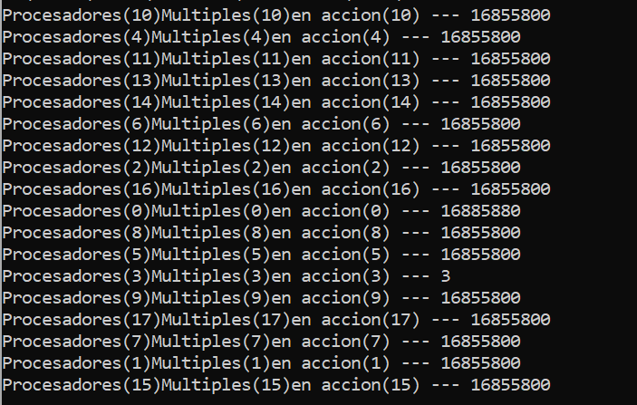

# Actividad 1.3

El siguiente código hace uso de OpenMP para realizar la ejecución de multiples instrucciones de manera paralela con el uso de threads. Este código se ejecutó con 3, 6, 9, 12, 15 y 18 threads, donde cada programa se ejecutó 15 veces, al finalizar el reporte se muestran las graficas, donde se muestra el primer thread en ejecutar una instruccion en cada ejecución del programa.


**Código**

El código utilizado para esta actividad es bastante sencillo, pero primero hay que decir que practicamente todos los códigos mostrados en el repositorio hacen uso de OpenMP, por lo que siempre se incluira la libreria "omp.h" y los programas se compilarán con gcc -fopenmp nombre.c.  

En el código aquí mostrado, primero se definen el numero de threads, con la instrucción define que se muestra. Este numero de threads, será puesto con la instrucción omp_set_num_threads(NUM_THREADS). Finalmente en el bloque de código de #pragma omp parallel, se ejecutan las instrucciones de manera paralela. En este caso lo unico que se hace es mostrar el numero de thread que está ejecutando la instrucción en ese momento,  

``` C
    #include <stdio.h>
    #include "omp.h"
    #define NUM_THREADS 18
    int main()
    {
        omp_set_num_threads(NUM_THREADS);
        #pragma omp parallel
        {
            int ID = omp_get_thread_num();
            printf("Procesadores(%d)",ID);
            printf("Multiples(%d)",ID);
            printf("en accion(%d) --- %d\n",ID);
        }
    }
```
**Resultados**

Al ejecutar el programa, obtenemos las siguientes impresiones en consola, con el numero de thread ejecutando la instrucción



En las siguientes gráficas se puede observar qué thread fue el primero en ejecutar una instrucción printf en cada una de las 15 ejecuciones. Cabe destacar que este código hace uso de OpenMP para su ejecución y la numeración de los threads empieza desde 0

