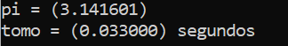
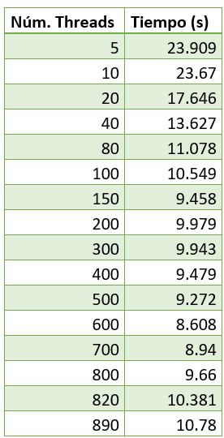
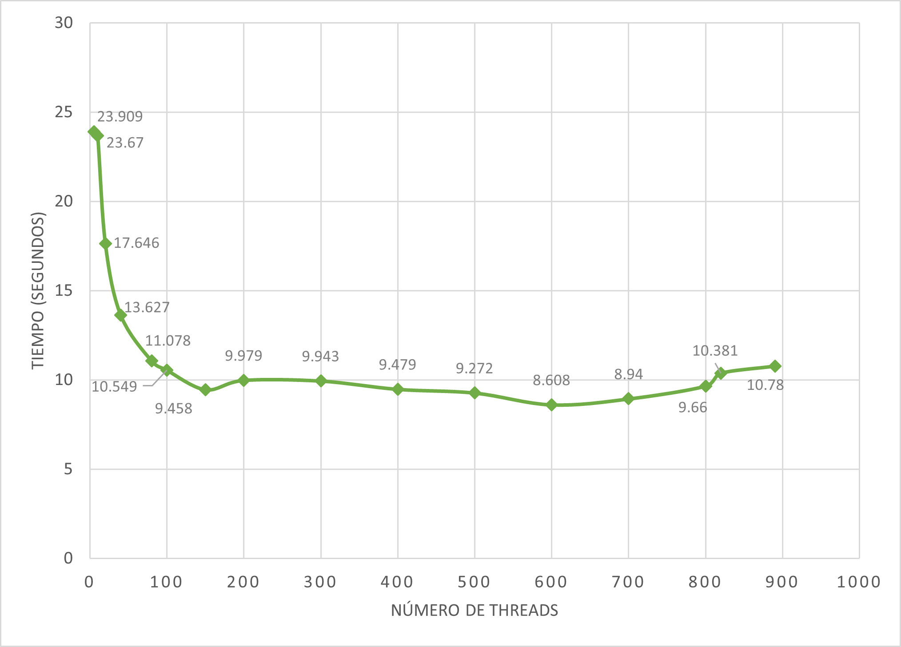

# Actividad 1.4

El siguiente código, consiste en un programa en C que, haciendo uso de fopenmp, calcula el area bajo la curva de una función, de manera paralela por medio de threads. Posteriormente se realizó una gráfica y la tabla de resultados, de ejecutar un total de 16 veces el programa, mostrando cómo se comporta el tiempo de ejecución según el numero de threads. Cabe recalcar que lo único que se modificó en cada ejecución fue el número de threads a usar, donde el máximo permitido por el equipo es de 891.

- Numero de pasos = 1x10^9


**Código**

A continuación se explicará el código para calcular la integral definida de una función cuyo resultado se aproxima a pi

Al inicio del código están las librerias que se van a utilizar, en este caso incluimos a math.h porque se hará uso de la función de potencia. Por el otro lado se define el numero de pasos y de threads a usar

``` C
#include <stdio.h>
#include <omp.h>
#include <math.h>

static long num_pasos = 100000000;
double delta;
#define NUM_THREADS 6
```

Ya en el main se empiezan declarando las variables a usar, así como asignando el numero de threads

``` C
int main(){

    int i, nthreads;
    double pi, resultado[NUM_THREADS],t1,t2,tiempo;
    delta = 1.0/num_pasos;
    omp_set_num_threads(NUM_THREADS);
    t1= omp_get_wtime();
```

La siguiente parte del código es la principal, gracias al pragama se observa que este bloque esta paralelizado, basicamente lo que se hace es que dependiendo del numero de thread, el resultado de la sumatoria se irá guardando en la posicion del arreglo correspondiente. Esta sumatoria se realiza calculando x y evaluando la función para posteriormente sumarla al acumulado y guardarla. Al terminar se suman todos los resultados acumulados según el thread y se multiplican por delta

``` C
#pragma omp parallel
    {
        int i,id,nthrds;
        double x;
        id = omp_get_thread_num();
        nthrds = omp_get_num_threads();
    //printf("%d\n",id);
        if (id == 0) nthreads = nthrds;
        for(i = id, resultado[id]=0.0; i < num_pasos;i = i+nthrds){
        x = (i+0.5)*delta;
        printf("%f\n",x);
        resultado[id] += 4.0/(1.0+pow(x,2));
        } 
    }

    for(i=0,pi=0.0;i<nthreads;i++){
        pi+=resultado[i]*delta;
    }
```

Para ginalizar el programa se imprime el valor de pi calculado y el tiempo

``` C

    t2= omp_get_wtime();
    tiempo = t2 - t1;
    printf("pi = (%lf)\n",pi);
    printf("tomo = (%lf) segundos\n",tiempo);
    return 0;
} 

```
**Resultados**

Al ejecutar el programa, se muestra la siguiente información: 



Cabe resaltar que el resultado siempre estará muy cercano a pi, aunque depende del numero de pasos

Despues de ejecutar el programa 20 veces, se obtuvo la siguiente información ,en la gráfica se observa cómo se comporta el tiempo de ejecución según el numero de threads






A partir de los resultados obtenidos podemos observar que el tiempo de ejecución fue disminuyendo entre más threads se usaran, sin embargo, a partir de los 150 threads, este tiempo se mantuvo casi constante, variando por menos de 1 segundo; fue con 600 threads que se obtuvo el mejor resultado, con tan sólo 8.608 segundos de ejecución, partir de ahí el tiempo de ejecución fue aumentando hasta llegar a 10.78 segundos con 890 threads, cantidad máxima de threads que permite el equipo, por lo que a pesar de que el tiempo de ejecución aumentó, en ningún momento llegó a los tiempos de ejecución obtenidos con pocos threads. 
