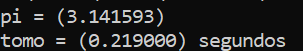
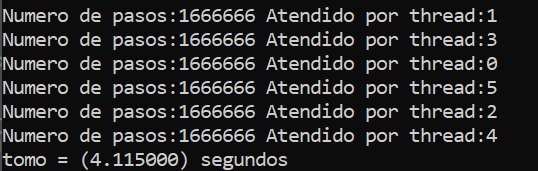

# Actividad 1.5

En esta actividad se tiene como objetivo comparar las diferentes velocidades de lecto-escritura de una computadora portátil; para realizar las mediciones, se desarrollaron tres diferentes programas en C, haciendo uso de la API de OpenMP. Los parámetros escogidos para realizar estas mediciones fueron prácticamente los mismos en cada programa, pero tomando en cuenta que el número de operaciones del primer programa se divide entre seis en los demás programas, esto se debe a que en el primer programa cada thread ejecuta cierto número de pasos del total, mientras que en los programas 2 y 3 cada thread ejecuta el número de pasos completo. 

A continuación, se muestran los parámetros usados:

- Numero de Threads: 6
- Operaciones (usado en el programa 1): 9999996
- Numero de Operaciones / 6 (usado en los programas 2 y 3): 1666666


**Códigos**

Como se mencionó, en esta actividad se utilizan tres programas distintos, sin embargo el primero es el mismo que el que se explica en la actividad 1.4, por lo que se omite la explicación

- Velocidad de la RAM (programa 2): Para obtener la velocidad de la memoria RAM, se usó el programa que calcula una ecuación diferencial por medio del método de Euler, en este caso tambien se hacen uso de threads, pero el programa funciona como un programa TLP, ya que cada hilo ejecuta una tarea diferente. Cabe destacar que para asegurar que el programa corra en la RAM, se hizo uso de arreglos para guardar los datos de los hilos, y el tiempo se midió hasta antes de escribir en los archivos .txt que genera el programa
  
  Se empiezan definiendo las librerias necesarias y declarando los arreglos donde se guardaran los resultados segun el numero de pasos y threads
  
  ``` C
  #include <stdio.h>
  #include <omp.h>
  #include <math.h>
  #define NUM_THREADS 6

     FILE *fptr;
     FILE *fptr1;
     FILE *fptr2;
     FILE *fptr3;
     FILE *fptr4;
     FILE *fptr5;
     double t[1666666][6];
     double w[1666666][6];
  ```
  
  La funcion iteracion se encarga de implementar el método de Euler, por lo que es la función más importante en el programa, sin entrar a muchos detalles, esta función resuelve una ecuacion diferencial, que en este caso se define tanto por los arreglos w y t
  
  ``` C
  void iteracion(int numP,int N, FILE *x)
  {
	fprintf(x, "Datos que encuentra el metodo de Euler(variable ind.\t variable dep.\t numero de thread)\n");
    double h,ab;
    double w0=0.5,a=0,b=2;
    int i;
    fprintf(x, "%f\t %f\n", a, w0);
    h=(b-a)/N;
    w[0][numP] = w0;
    t[0][numP] = a;
    for(i=0;i<N;i++){
        t[i][numP]=a+(h*i);
        w[i][numP]=w[i-1][numP]+h*(1+sqrt(t[i-1][numP]*t[i-1][numP]-w[i-1][numP]));
       } 
     }
  ```
  De lado del programa principal, se declaran los apuntadores a los respectivos archivos de salida
  
  ``` C
  int main()
  {  omp_set_num_threads(NUM_THREADS);
   double t1,t2;
   int N = 1666666;
   fptr=fopen("Euler_n_0.txt","w");
   fptr1=fopen("Euler_n_1.txt","w");
   fptr2=fopen("Euler_n_2.txt","w");
   fptr3=fopen("Euler_n_3.txt","w");
   fptr4=fopen("Euler_n_4.txt","w");
   fptr5=fopen("Euler_n_5.txt","w");
  ```
  
  Para la parelizacion se hace uso de un sections, donde se manda a llamar a la funcion del metodo de Euler con sus parametros
  
  ``` C
	  t1= omp_get_wtime();
	   #pragma omp parallel
	{
	     #pragma omp sections
	    {
	       #pragma omp section
		 (void)iteracion(1666666,fptr);//20//2000900
	       #pragma omp section
		 (void)iteracion(1666666,fptr1);//200//2000400
	       #pragma omp section
		 (void)iteracion(1666666,fptr2);//2000//2000700
	       #pragma omp section
		 (void)iteracion(1666666,fptr3);//20000//2000800
	       #pragma omp section
		 (void)iteracion(1666666,fptr4);//200000//2000500
	       #pragma omp section
		 (void)iteracion(1666666,fptr5);//2000000//2000100
	   }
	}
   
  ```
  
  Para finalizar, se mandan a imprimir los resultados en el txt
  
  ``` C
  
	  t2= omp_get_wtime();
	   printf("tomo = (%lf) segundos\n",t2-t1); 
	   for(int i=0;i<N;i++){
		fprintf(fptr, "%f\t %f\t  numero de thread:%d\n", t[i][0], w[i][0], 0);
	    }

	    for(int i=0;i<N;i++){
		fprintf(fptr1, "%f\t %f\t  numero de thread:%d\n", t[i][1], w[i][1], 1);
	    }

	    for(int i=0;i<N;i++){
		fprintf(fptr2, "%f\t %f\t  numero de thread:%d\n", t[i][2], w[i][2], 2);
	    }

	    for(int i=0;i<N;i++){
		fprintf(fptr3, "%f\t %f\t  numero de thread:%d\n", t[i][3], w[i][3], 3);
	    }

	    for(int i=0;i<N;i++){
		fprintf(fptr4, "%f\t %f\t  numero de thread:%d\n", t[i][4], w[i][4], 4);
	    }

	    for(int i=0;i<N;i++){
		fprintf(fptr5, "%f\t %f\t  numero de thread:%d\n", t[i][5], w[i][5], 5);
	    }  

	   fclose(fptr);
	   fclose(fptr1);
	   fclose(fptr2);
	   fclose(fptr3);
	   fclose(fptr4);
	   fclose(fptr5);
	   return (0);

	   }

  ```

- Velocidad del disco duro (programa 3): este programa funciona de manera casi idéntica que el segundo, calculando una derivada parcial por medio del método de Euler y haciendo uso de threads, la diferencia principal está en que en este programa se van escribiendo los resultados en archivos .txt y el tiempo se acaba de medir hasta que se acaban de escribir, con lo que se asegura que se este calculando la velocidad del disco duro

La principal diferencia esta en la función que realiza el método de Euler, ya que ahora en la misma función se manda a escribir en los archivos

  ``` C
  void iteracion(int N, FILE *x)
{
	printf("Numero de pasos:%d Atendido por thread:%d\n", N,omp_get_thread_num());
	fprintf(x, "Datos que encuentra el metodo de Euler(variable ind.\t variable dep.\t numero de thread)\n");
      double h,t,w,ab;
      double w0=0.5,a=0,b=2;
      int i;
      w=w0;
      fprintf(x, "%f\t %f\n", a, w);
      for(i=0;i<N;i++){
          h=(b-a)/N;
          t=a+(h*i);
          ab=t*t;
          w=w+h*(w-(t*t)+1);
          fprintf(x, "%f\t %f \t numero de thread:%d\n", t+h, w,omp_get_thread_num());
         } }
  ```
**Resultados**

Los resultados obtenidos por cada uno de los programas fueron los siguientes:

- Programa 1

  }
  
- Programa 2

  
  
- Programa 3

  

Como conclusión, se puede decir que los resultados cumplieron con lo esperado, ya que la cache es la memoria más rápida mientras que el disco dura la más lenta, asimismo, se puede observar que en operaciones la suma es la más rápida, lo cual tambien tiene sentido ya que seguramente se encuentra implementada en el procesador, en cambio las operaciones más lentas probadas fueron los logaritmos, con lo que se puede notar que el tipo de operación sí influye en el tiempo de ejecución, al menos en el caso del equipo con el que se realizaron las pruebas. 


