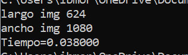

# Actividad 2.1

Se desarrolló un programa en C que permita convertir una imagen bmp a escala de grises, así como invertir la imagen respecto a la horizontal y la vertical. Para ello se hizo uso de openMP, y en especial de la instrucción openmp parallel for; con el objetivo de que los threads se asignen secuencialmente en la imagen a la instrucción se le añadió la cláusula de Schedule, y en momentos en los que es necesario usar fors anidados se añadió collapse, para que se paralelicen los fors anidados


**Código**

La primera función es assignImage, la cual se manda a llamar hasta el final, ya que lo unico que hace es escribir los datos del apuntador que guarda la información de la imagen de salida, en el archivo de salida

``` C
void assignImage(char* ptr,long ancho, long alto,unsigned char fotoB[][ancho], FILE *outputImage){
 for (int i = 0; i < alto*ancho; ++i) {
      fputc(ptr[i], outputImage);
      fputc(ptr[i+1], outputImage);
      fputc(ptr[i+2], outputImage);
    }

```

La siguiente función es la más importante ya que es la que se encarga de voltar la imagen, ya sea de manera horizontal o vertical, lo cual se puede decidir dependiendo de el parametro que le pases con la variable inv. Para llevar a cabo el proceso, lo que se hace es guardar de distintas maneras la información de la imagen en un apuntador, lo cual se consigue recorriendo el arreglo de diferentes maneras. Una vez que la información esta en el apuntador, tambien se modifica el arreglo que guarda la copia de la imagen para que se actulice 

``` C
void flipImage(char* ptr,long ancho, long alto,unsigned char fotoB[][ancho], char inv){
    int count = 0;
    if(inv == 1){
    // Vertical flip
    #pragma omp single
    for(int i=alto; i>0;i--){
        for(int j=ancho; j>0;j--){
        ptr[count] = fotoB[i][j]; //b
        ptr[count+1] = fotoB[i][j]; //g
        ptr[count+2] = fotoB[i][j]; //r
        count++;
        }
    }
    //Horizontal flip
    }
    else if(inv == 2){
        #pragma omp single
        for(int i=0; i<alto;i++){
            for(int j=ancho; j>0;j--){
            ptr[count] = fotoB[i][j]; //b
            ptr[count+1] = fotoB[i][j]; //g
            ptr[count+2] = fotoB[i][j]; //r
            count++;
            }
        }
    }
    // Save Image
    count = 0;
    for(int i=0; i<alto;i++){
        for(int j=0; j<ancho;j++){
        fotoB[i][j] = ptr[count]; //b
        fotoB[i][j] = ptr[count+1]; //g
        fotoB[i][j] = ptr[count+2]; //r
        count++;
        }
    }

    }
}
```

Empezando en el main, se llava a cabo el proceso comun para empezar a trabajar imagenes bmp, como definir los apuntadores, guardar la información de la cabecera y e converir a escala de grises, para guardar los valores en un arreglo. Tambien cabe destacar que la lectura esta paralelizada

``` C
int main()
{
  omp_set_num_threads(NUM_THREADS);
  FILE *image, *outputImage_0, *lecturas;
  image = fopen("7.bmp","rb");          //Imagen original a transformar
  outputImage_0 = fopen("imgs/0.bmp","wb");
  long ancho;
  long alto;
  unsigned char r, g, b;               //Pixel
  unsigned char* ptr;

  unsigned char xx[54];
  
  for(int i=0; i<54; i++) {
    xx[i] = fgetc(image);
    fputc(xx[i], outputImage_0); 
  }


  ancho = (long)xx[20]*65536+(long)xx[19]*256+(long)xx[18];
  alto = (long)xx[24]*65536+(long)xx[23]*256+(long)xx[22];
  printf("largo img %li\n",alto);
  printf("ancho img %li\n",ancho);

  ptr = (unsigned char*)malloc(alto*ancho*3* sizeof(unsigned char));
    
  unsigned char foto[alto][ancho], fotoB[alto][ancho];
  unsigned char pixel;
#pragma omp parallel for schedule (dynamic) collapse(2)
    for(int i=0; i<alto;i++){
      for(int j=0; j<ancho;j++){
        b = fgetc(image);
        g = fgetc(image);
        r = fgetc(image);

        pixel = 0.21*r+0.72*g+0.07*b;
        foto[i][j]=pixel;
        fotoB[i][j]=pixel;
      }
    }
```

Para finalizar lo unico que se hace es mandar a llamar a las funciones dependiendo de lo que se quiera lograr, en este caso por ejemplo la imagen se volteria vertical y luego horizontalmente, lo ultimo por llevar a cabo es cerrar los archivos

``` C
 const double startTime = omp_get_wtime();  
  flipImage(ptr,ancho, alto,fotoB,1);
  flipImage(ptr,ancho, alto,fotoB,2);
  assignImage(ptr,ancho, alto,fotoB,outputImage_0);
  const double endTime = omp_get_wtime();

  free(ptr);
  fclose(image);
  fclose(outputImage_0);
  printf("Tiempo=%f", endTime-startTime);
  return 0;
}

```


**Resultados**

Al ejecutar el programa, se muestra en consola la información del tamaño de la imagen y el tiempo de ejecución. Asimismo, se guardan en la ubicacion correspondiente el archivos de salida



Para probar el código se utizo la imagen siguiente:

Imagen 1

![Original 1]./Imagen2_1_1.bmp)

Para mostar los resultados se ejecuto tres veces el programa

Vertical

![Grafica 1]./Imagen2_1_2.bmp)

Horizontal

![Grafica 1]./Imagen2_1_3.bmp)

![Grafica 1]./Imagen2_1_2.bmp)


De las imagenes resultantes podemos notar que aquellas con parelización poseen bastante más ruido debido a la manera en la que se manejan los threds

