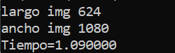
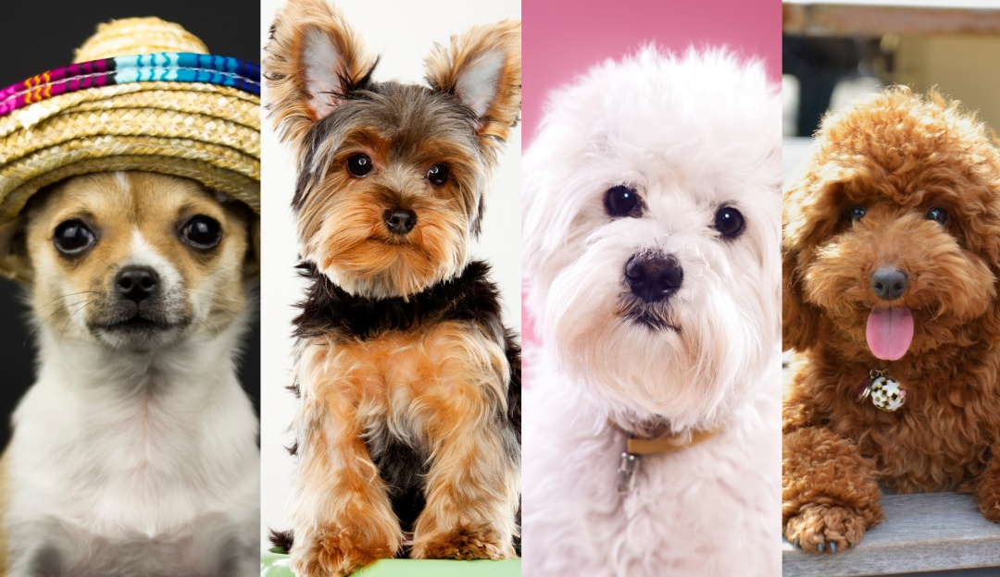
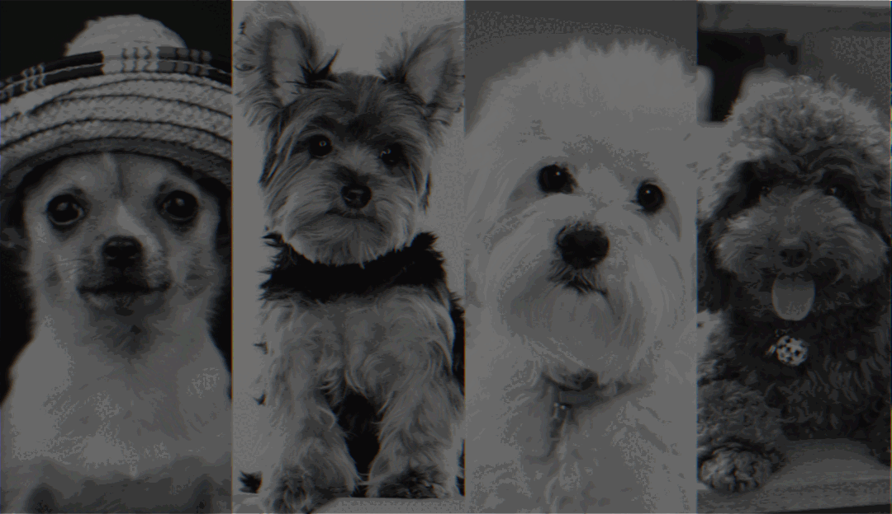
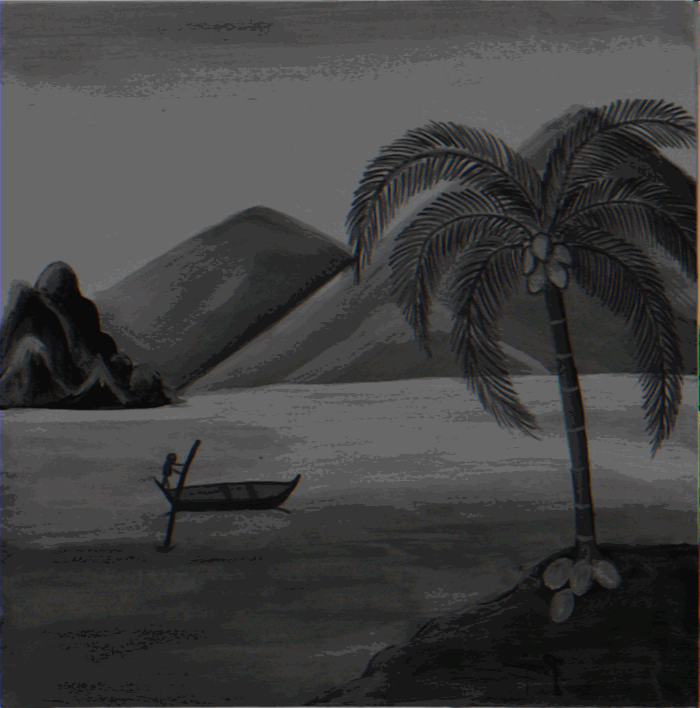

# Actividad 2.2

Se desarrolló un programa en C, el cual tiene el objetivo de aplicarle el efecto de desenfoque con diferentes intensidades a un par de imágenes bmp de diferente tamaño, así como invertir la imagen en determinados resultados. Esto se debe realizar tanto de manera paralelizada como sin paralelización con el fin de comparar los resultados obtenidos 


**Código**

Sólo se comentará el código paralelizado, ya que en funcionamiento, este y el no paralelizado son practicamente iguales, ademas el código utilizado es similar al de la actividad 2.1 en mayor medida, el cual ya se explicó anteriormente por lo que sólo se describirá brevemente, enfocandose en los cambios y añadidos que presenta este código con respecto al anterior  

La primera función que se encuentra en el programa es la de assignImage, lo que hace en primera instancia es asignarle al apuntador de salida, los valores que deberá escribir en el archivo de salida, esto depende de si se desea invertir la imagen o no, ya que la manera en la que se recorre el arreglo será distinta, una vez que el apuntador tiene los valores deseados, estos son escritos en el archivo de salida

``` C
void assignImage(char* ptr,long ancho, long alto,unsigned char fotoB[][ancho], FILE *outputImage,char inv){
int count = 0;
if(inv == 0){
  for(int i=0; i<alto;i++){
    for(int j=0; j<ancho;j++){
      ptr[count] = fotoB[i][j]; //b
      ptr[count+1] = fotoB[i][j]; //g
      ptr[count+2] = fotoB[i][j]; //r
      count++;
    }
  }
}
else{
 for(int i=0; i<alto;i++){
    for(int j=ancho; j>0;j--){
      ptr[count] = fotoB[i][j]; //b
      ptr[count+1] = fotoB[i][j]; //g
      ptr[count+2] = fotoB[i][j]; //r
      count++;
    }
  }
}
 for (int i = 0; i < alto*ancho; ++i) {
      fputc(ptr[i], outputImage);
      fputc(ptr[i+1], outputImage);
      fputc(ptr[i+2], outputImage);
    }

}
```

``` C
void assignImage(char* ptr,long ancho, long alto,unsigned char fotoB[][ancho], FILE *outputImage,char inv){
int count = 0;
if(inv == 0){
  for(int i=0; i<alto;i++){
    for(int j=0; j<ancho;j++){
      ptr[count] = fotoB[i][j]; //b
      ptr[count+1] = fotoB[i][j]; //g
      ptr[count+2] = fotoB[i][j]; //r
      count++;
    }
  }
}
else{
 for(int i=0; i<alto;i++){
    for(int j=ancho; j>0;j--){
      ptr[count] = fotoB[i][j]; //b
      ptr[count+1] = fotoB[i][j]; //g
      ptr[count+2] = fotoB[i][j]; //r
      count++;
    }
  }
}
 for (int i = 0; i < alto*ancho; ++i) {
      fputc(ptr[i], outputImage);
      fputc(ptr[i+1], outputImage);
      fputc(ptr[i+2], outputImage);
    }

}
```

La siguiente función es la principal de este programa, ya que se encarga de realizar el efecto de blurring, para ello la función empieza calculando el tamaño del kerne, según el parametro que le pasemos, ademas, es necesario que ignore los pixeles de los bordes para poder aplicar correctamente el filtro sin salirse de la imagen. Ya con los datos, nos desplazamos por la imagen, multiplicando los elementos que se encuentran dentro del kernel para asignarle un valor al pixel central, el cual se guarda en su arreglo correspondiente para finalmente mandar a llamar la función anteriormente descrita

``` C
void blurrring(long ancho, long alto, int kernelSize, unsigned char foto [][ancho], unsigned char fotoB [][ancho], char* ptr, FILE *outputImage,char inv){
    int inicioX,inicioY,cierreX,cierreY,ladoX,ladoY;
    long cuenta = 0;
    long sum;
    for(int i=0;i<alto;i++){
    //iR=i*kernelSize;
    for(int j=0;j<ancho;j++){
      //jR=j*kernelSize;
      if(i<kernelSize){
        inicioX=0;
        cierreX=i+kernelSize;
        ladoX=i+kernelSize;
      } else if(i>=alto-kernelSize){
        inicioX=i-kernelSize;
        cierreX=alto;
        ladoX=alto-i+kernelSize;
      }else{
        inicioX=i-kernelSize;
        cierreX=i+kernelSize;
        ladoX=kernelSize*2+1;
      }
  
      if(j<kernelSize){
        inicioY=0;
        cierreY=j+kernelSize;
        ladoY=j+kernelSize;
      }else if(j>=ancho-kernelSize){
        inicioY=j-kernelSize;
        cierreY=ancho;
        ladoY=ancho-j+kernelSize;
      }else{
        inicioY=j-kernelSize;
        cierreY=j+kernelSize;
        ladoY=kernelSize*2+1;
      }
      sum=0;
      for(int x=inicioX;x<cierreX;x++){
        for(int y=inicioY;y<cierreY;y++){
          sum+=foto[x][y];
        }
      }
      sum=sum/(ladoX*ladoY);
      fotoB[i][j]=sum;
    }
  }
  assignImage(ptr,ancho, alto,fotoB,outputImage,inv);
}
```

De lado del main, se llava a cabo el proceso comun para empezar a trabajar imagenes bmp, definir los apuntadores, guardar la información de la cabecera y en este caso tambien se convierta a escala de grises, para guardar los valores en un arreglo

``` C
int main()
{
  FILE *image, *outputImage_1, *outputImage_2, *outputImage_3, *outputImage_4, *outputImage_5, *outputImage_6, *outputImage_7, *outputImage_8, *outputImage_9, *outputImage_10, *outputImage_11, *outputImage_12, *outputImage_13, *outputImage_14, *outputImage_15, *outputImage_16, *outputImage_17, *outputImage_18, *outputImage_19, *lecturas;
  image = fopen("7.bmp","rb");          //Imagen original a transformar
  outputImage_1 = fopen("imgs/1.bmp","wb");
  outputImage_2 = fopen("imgs/2.bmp","wb");
  outputImage_3 = fopen("imgs/3.bmp","wb");
  outputImage_4 = fopen("imgs/4.bmp","wb");
  outputImage_5 = fopen("imgs/5.bmp","wb");
  outputImage_6 = fopen("imgs/6.bmp","wb");
  outputImage_7 = fopen("imgs/7.bmp","wb");
  outputImage_8 = fopen("imgs/8.bmp","wb");
  outputImage_9 = fopen("imgs/9.bmp","wb");
  outputImage_10 = fopen("imgs/10.bmp","wb");
  outputImage_11 = fopen("imgs/11.bmp","wb");
  outputImage_12 = fopen("imgs/12.bmp","wb");
  outputImage_13 = fopen("imgs/13.bmp","wb");
  outputImage_14 = fopen("imgs/14.bmp","wb");
  outputImage_15 = fopen("imgs/15.bmp","wb");
  outputImage_16 = fopen("imgs/16.bmp","wb");
  outputImage_17 = fopen("imgs/17.bmp","wb");
  outputImage_18 = fopen("imgs/18.bmp","wb");
  outputImage_19 = fopen("imgs/19.bmp","wb");
  long ancho;
  long alto;
  unsigned char r, g, b;               //Pixel
  unsigned char* ptr;

  unsigned char xx[54];
  
  for(int i=0; i<54; i++) {
    xx[i] = fgetc(image);
    fputc(xx[i], outputImage_1); 
    fputc(xx[i], outputImage_2);
    fputc(xx[i], outputImage_3); 
    fputc(xx[i], outputImage_4);
    fputc(xx[i], outputImage_5); 
    fputc(xx[i], outputImage_6);
    fputc(xx[i], outputImage_7); 
    fputc(xx[i], outputImage_8);
    fputc(xx[i], outputImage_9); 
    fputc(xx[i], outputImage_10);
    fputc(xx[i], outputImage_11); 
    fputc(xx[i], outputImage_12);
    fputc(xx[i], outputImage_13); 
    fputc(xx[i], outputImage_14);
    fputc(xx[i], outputImage_15); 
    fputc(xx[i], outputImage_16);
    fputc(xx[i], outputImage_17); 
    fputc(xx[i], outputImage_18);
    fputc(xx[i], outputImage_19); 
  }


  ancho = (long)xx[20]*65536+(long)xx[19]*256+(long)xx[18];
  alto = (long)xx[24]*65536+(long)xx[23]*256+(long)xx[22];
  printf("largo img %li\n",alto);
  printf("ancho img %li\n",ancho);

  ptr = (unsigned char*)malloc(alto*ancho*3* sizeof(unsigned char));

    
  unsigned char foto[alto][ancho], fotoB[alto][ancho];
  unsigned char pixel;
  
    for(int i=0; i<alto;i++){
      for(int j=0; j<ancho;j++){
        b = fgetc(image);
        g = fgetc(image);
        r = fgetc(image);
        pixel = 0.21*r+0.72*g+0.07*b; 
        foto[i][j]=pixel; 
        fotoB[i][j]=pixel; 
      }
    }
```

La parelización se lleva a cabo con multiples sections, mandando a llamar a las funciones correspondientes, y segun si se desea invertir la imagen o no

``` C
const double startTime = omp_get_wtime();

  #pragma omp parallel
{
     #pragma omp sections 
    {
       #pragma omp section
       blurrring(ancho, alto, 1, foto , fotoB , ptr, outputImage_1,0);  
       #pragma omp section
       blurrring(ancho, alto, 2, foto , fotoB , ptr, outputImage_2,0);  
       #pragma omp section
       blurrring(ancho, alto, 3, foto , fotoB , ptr, outputImage_3,0);  
       #pragma omp section
       blurrring(ancho, alto, 4, foto , fotoB , ptr, outputImage_4,0);  
       #pragma omp section
       blurrring(ancho, alto, 5, foto , fotoB , ptr, outputImage_5,0);  
       #pragma omp section
       blurrring(ancho, alto, 6, foto , fotoB , ptr, outputImage_6,0);
       #pragma omp section
       blurrring(ancho, alto, 7, foto , fotoB , ptr, outputImage_7,0); 
       #pragma omp section
       blurrring(ancho, alto, 8, foto , fotoB , ptr, outputImage_8,0);
       #pragma omp section
       blurrring(ancho, alto, 9, foto , fotoB , ptr, outputImage_9,0);
       #pragma omp section
       blurrring(ancho, alto, 10, foto , fotoB , ptr, outputImage_10,1);
       #pragma omp section
       blurrring(ancho, alto, 9, foto , fotoB , ptr, outputImage_11,1); 
       #pragma omp section
       blurrring(ancho, alto, 8, foto , fotoB , ptr, outputImage_12,1);
       #pragma omp section
       blurrring(ancho, alto, 7, foto , fotoB , ptr, outputImage_13,1);  
       #pragma omp section
       blurrring(ancho, alto, 6, foto , fotoB , ptr, outputImage_14,1); 
       #pragma omp section
       blurrring(ancho, alto, 5, foto , fotoB , ptr, outputImage_15,1);
       #pragma omp section
       blurrring(ancho, alto, 4, foto , fotoB , ptr, outputImage_16,1); 
       #pragma omp section
       blurrring(ancho, alto, 3, foto , fotoB , ptr, outputImage_17,1); 
       #pragma omp section
       blurrring(ancho, alto, 2, foto , fotoB , ptr, outputImage_18,1); 
       #pragma omp section
       blurrring(ancho, alto, 1, foto , fotoB , ptr, outputImage_19,1);
         
   }
}
  const double endTime = omp_get_wtime();

```

Finalmente para terminar, se libera la memoria del apuntador y se cierran los archivos

``` C
  free(ptr);
  fclose(image);
  fclose(outputImage_1);
  fclose(outputImage_2);
  fclose(outputImage_3);
  fclose(outputImage_4);
  fclose(outputImage_5);
  fclose(outputImage_6);
  fclose(outputImage_7);
  fclose(outputImage_8);
  fclose(outputImage_9);
  fclose(outputImage_10);
  fclose(outputImage_11);
  fclose(outputImage_12);
  fclose(outputImage_13);
  fclose(outputImage_14);
  fclose(outputImage_15);
  fclose(outputImage_16);
  fclose(outputImage_17);
  fclose(outputImage_18);
  fclose(outputImage_19);

  printf("Tiempo=%f", endTime-startTime);
  return 0;
}

```


**Resultados**

Al ejecutar el programa, se muestra en consola la información del tamaño de la imagen y el tiempo de ejecución. Asimismo, se guardan en la ubicacion correspondiente los archivos de salida



Para probar el código se utilizaron las siguientes imagenes

Imagen 1



Imagen 2


El programa arrojo un total de 19 imagenes de salida, las cuales se unieron mediante una pagina web para realizar gifs, los resultados fueron los siguientes:







De las imagenes resultantes podemos notar que aquellas con parelización poseen bastante más ruido debido a la manera en la que se manejan los threds
