# Proyecto Final

Para el siguiente proyecto se configuró Ubuntu en una maquina virtual de un servicio en la nube, en este caso Azure, esto con el objetivo de ejecutar las actividades en las que está involucrado fopenmp, siendo estas las actividades 1.3, 1.4, 1.5, 2.1 y 2.2, para finalmente comparar los resultados obtenidos con los del equipo personal.  
A continuación se explican los pasos que se siguieron

## Configuración de VM en Azure

- Entramos a portal.azure.com e iniciamos sesión

  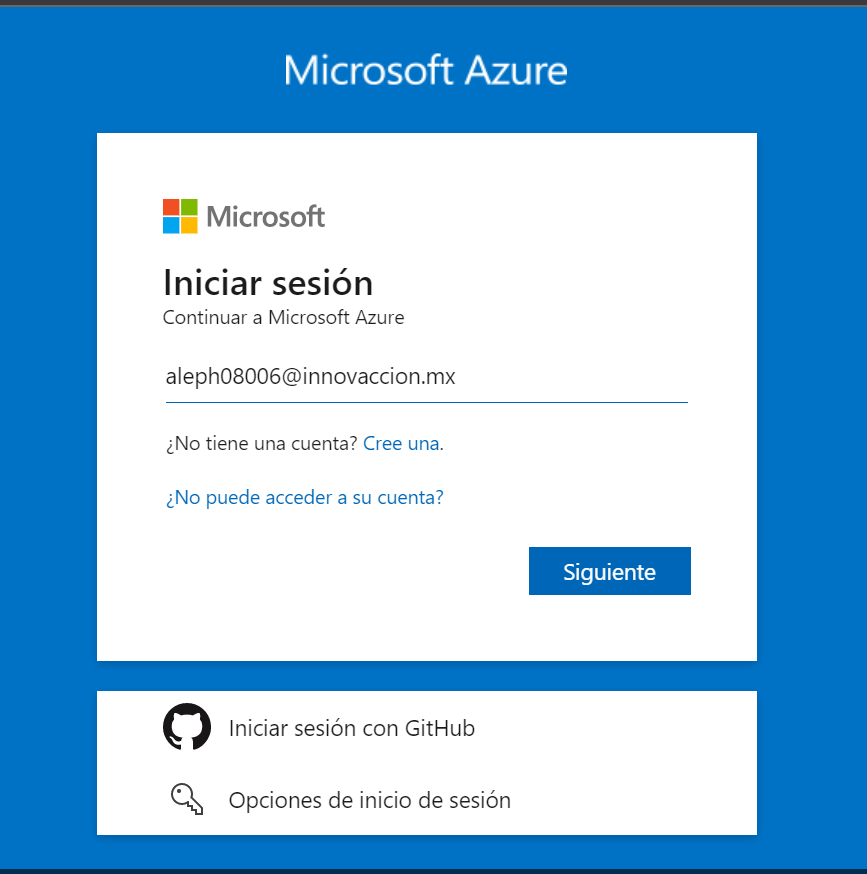
  
- En mi caso estoy usando una cuenta educativa que me regala 100 dolares para usar

  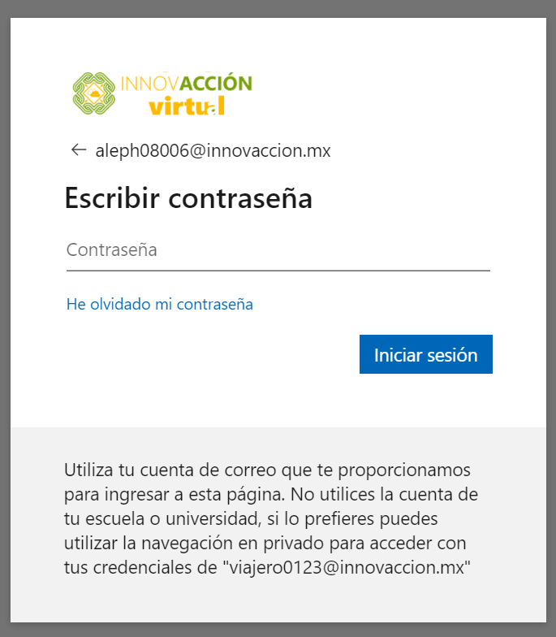
  
- Una vez con la sesión iniciada la pantalla de inicio se ve de la siguiente manera. Seleccionamos maquinas virtuales

  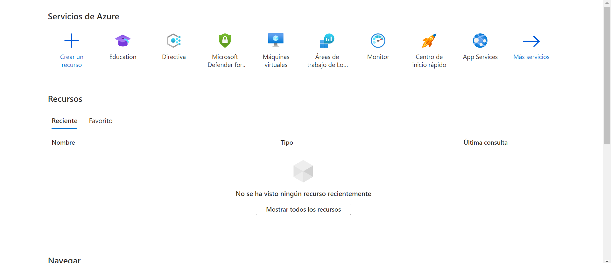

- Nos dirigirá a la siguiente página 

  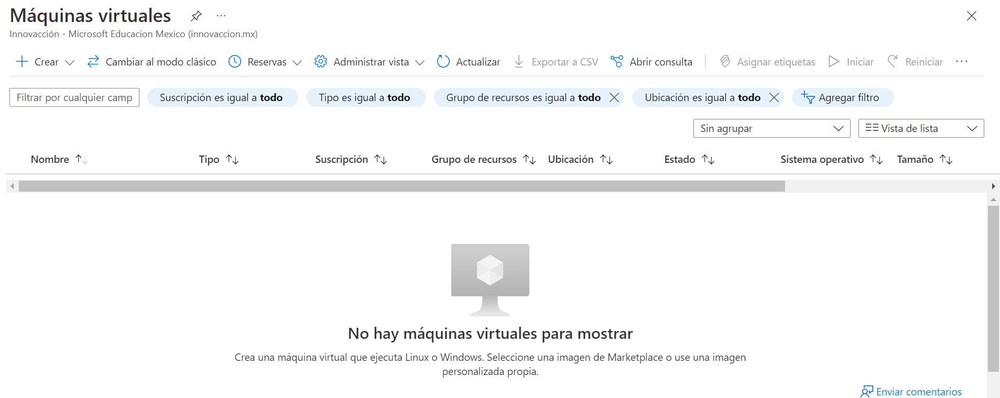
  
- Seleccionamos crear --> Maquina virtual de Azure

  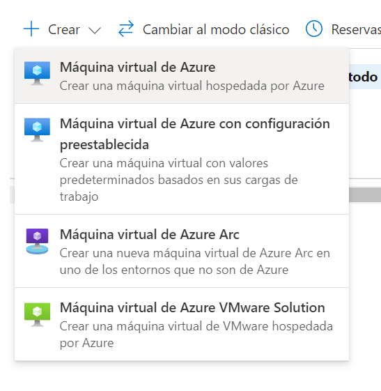
  
- Lo que sigue es configurar varios parametros de la maquina virtual, como por ejemplo la región

  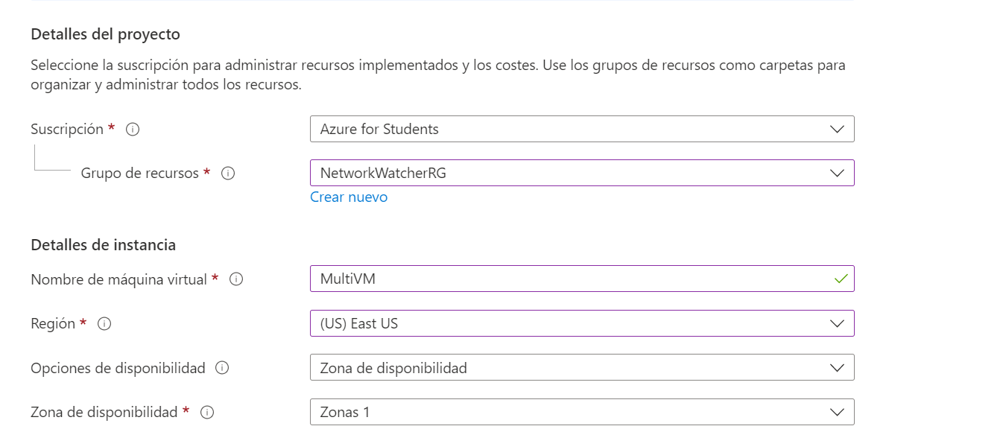

- Seleccionamos un sistema operativo basado en Linux en este caso Ubuntu Server

  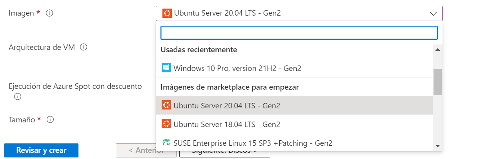
  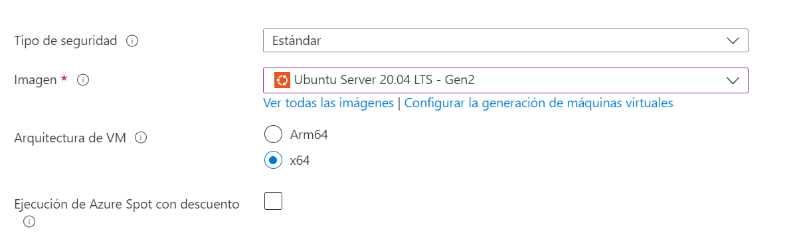

- El siguiente paso será seleccionar la Maquina Virtual a utilizar.
  
  Se eligió una de las más básicas con las siguientes caracteristicas:
  - 1 vCPU
  - 1 GiB de RAM
  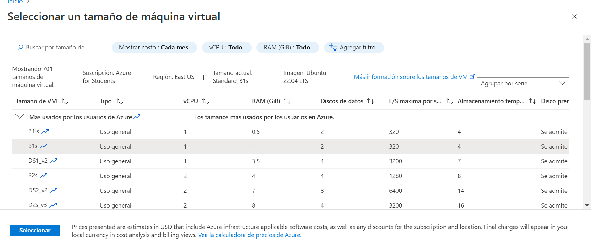

- En el siguiente pasó se permite la conexión por medio de SSH, por lo que se habilita el puerto 22

  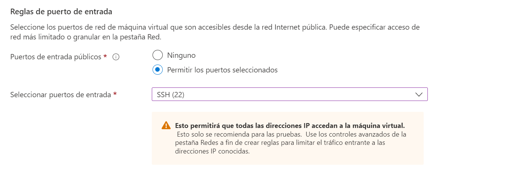
  
- Lo que sigue es elegir un disco duro en este caso es un SSD estandar de 30 GB. Damos click en el botón revisar y crear

  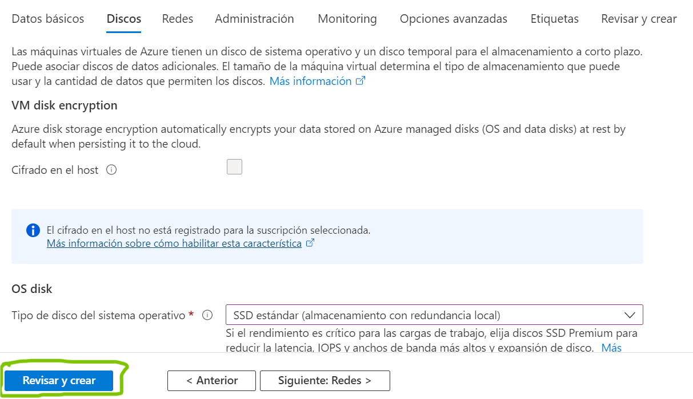

- Nos pedirá validar los datos, si todo está correcto damos click en Crear

  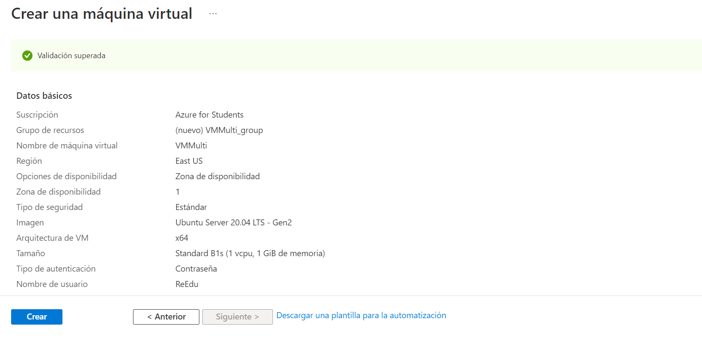

- Si la maquina virtual se creó de manerá correcta, despues de un tiempo aparecerá la siguiente pantalla

  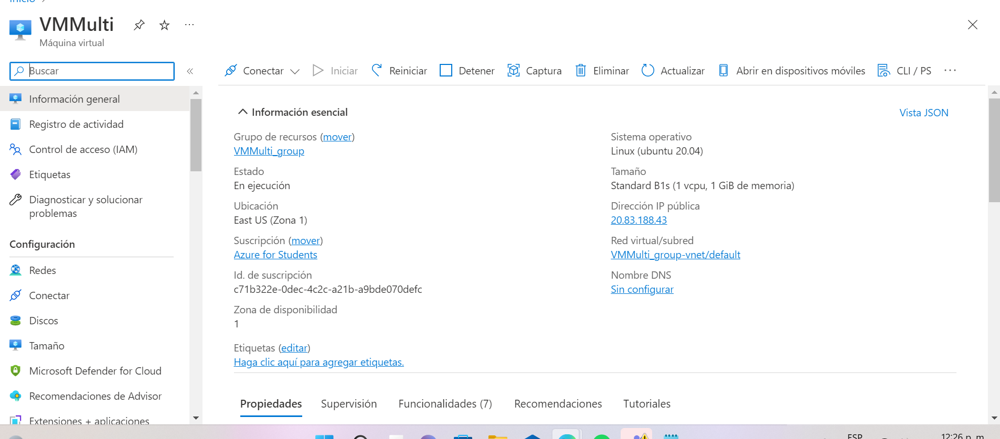
 
## Conexión a la VM
  
- Seleccionamos conectar --> Bastion. Ya que es una de las formas más sencillas de conectarse

  
  
- Si no tenemos ninguna instancia de Bastion creada entonces creamos una

  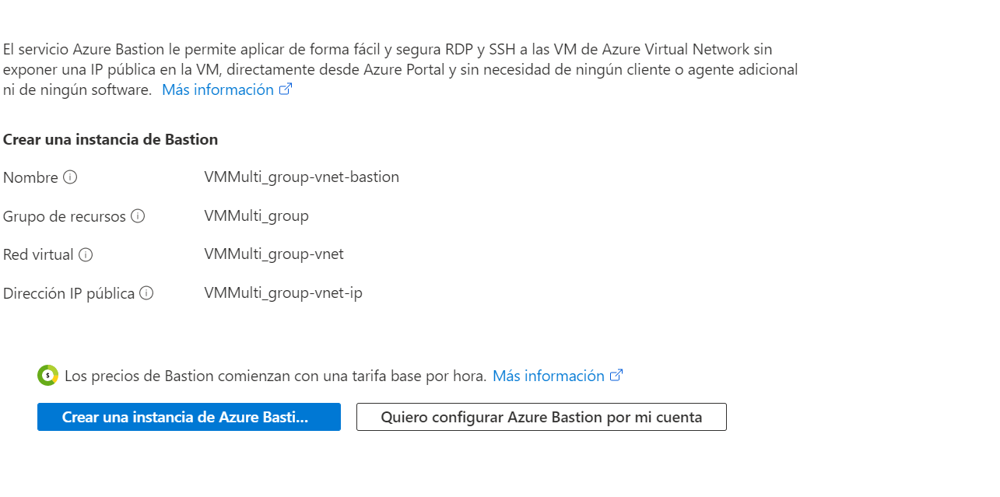
  
- Esperamos a que se cree y nos podrénos conectar a la VM introduciendo usuario y contraseña

  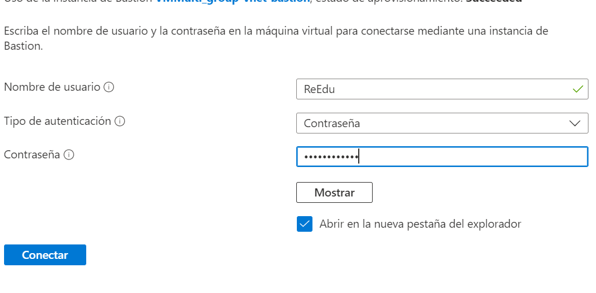
  
- Nos abrirá otra pestaña con la terminal de Ubuntu

  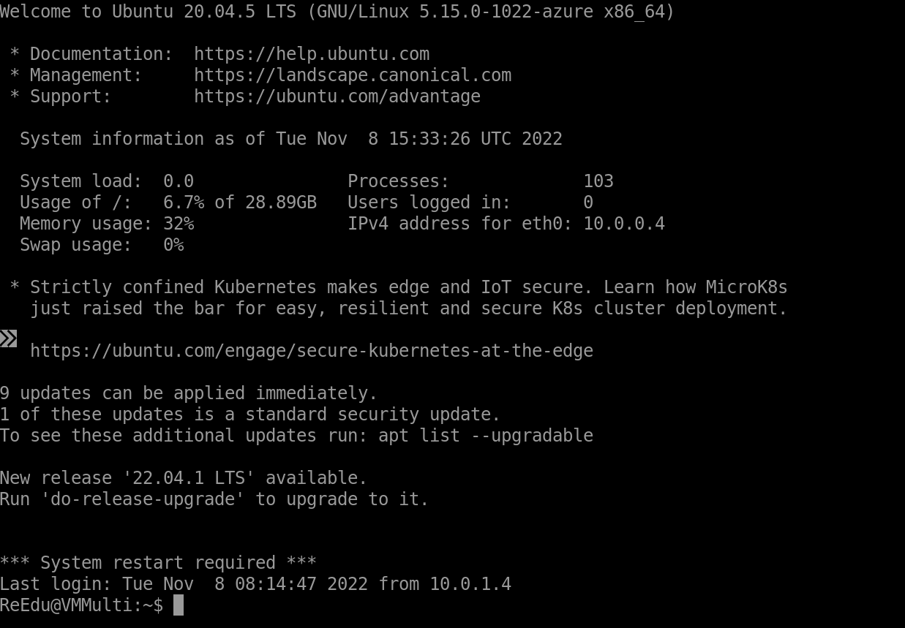
  
## Subir los archivos a la VM

Para subir los archivos se ejecuta el siguiente comando en una terminal de la PC local
```
scp -r C:\Users\ibmor\OneDrive\Documentos\lalo\Codigos ReEdu@20.83.188.43:
```
La sintaxis es muy sencilla
scp -r origen destino

En este caso el origen es una carpeta de la PC local y el destino la VM, la cual se indica con el nombre_de_usuario@dirección_ip_publica. Esto se puede invertir para descargar archivos de la VM, en lugar de subirlos

Si no se conoce la ip publica, esta se encuentra en la página principal de la VM 

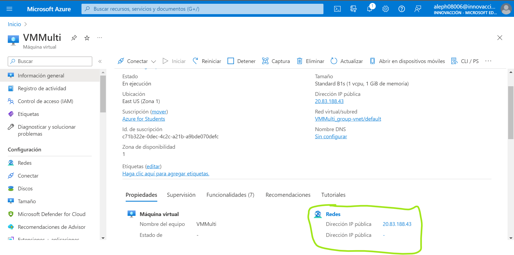

Una vez que el comando se ejecuto de forma correcta, los archivos se subirán

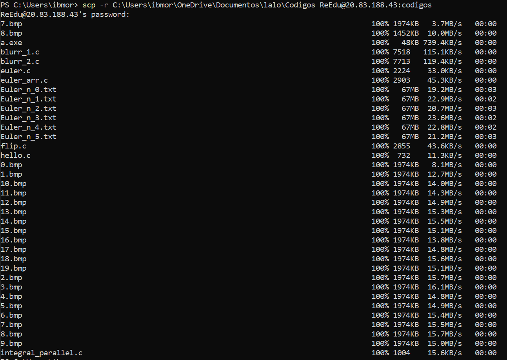

Si se requiere descargar los archivos generados en la VM, se ejecuta el mismo comando de forma inversa
```
scp -r ReEdu@20.83.188.43:~\Codigos C:\Users\ibmor\OneDrive\Documentos\lalo\Final\Resultados
```
Una vez ejecutado se observa el proceso de descarga

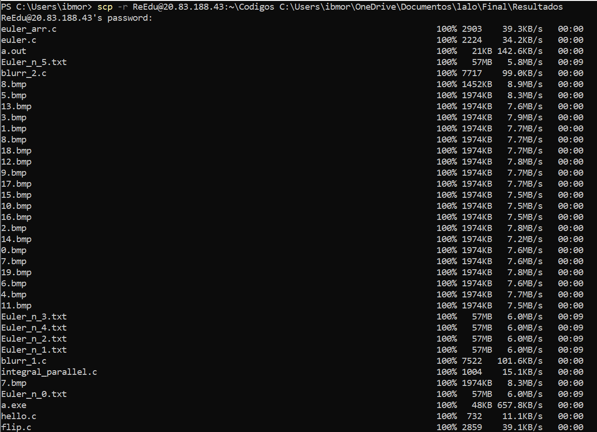

## Ejecutar actividades

Se ejecutó cada una de las actividades tanto en la maquina virtual como en la computadora personal. A continuación se mencionan las caracteristicas de cada una  

- VM
  - 1 vCPU
  - 1 GiB de RAM
  - SSD
  - Ubuntu Server 

- PC
  - 12 GB de RAM
  - 4 Nucleos
  - Procesador Intel I7-1165G7
  - SSD
  - Windows
  

- Actividad 1.3

  - **PC**
    
    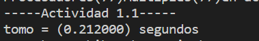  
    
  - **VM**
  
    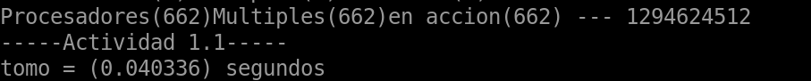  
    
  - **SpeedUp**

    Los resultados del SpeedUp de la PC se muestran a continuación. 
       
    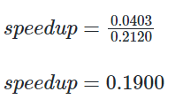  
    
   
    
- Actividad 1.4
  
  - **PC**
    
    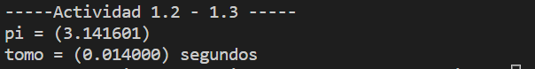  
    
  - **VM**
  
    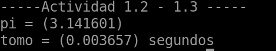  
    
  - **SpeedUp**

    Los resultados del SpeedUp de la PC se muestran a continuación. 
    
    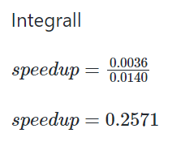  

- Actividad 1.5
- Actividad 2.1
- Actividad 2.2

## Conclusiones

Podemos observar que contrario a lo pensado (que la PC siempre tenga mejores tiempos) la VM resulta obtener mejores resultados en algunos programas, sin embargo la diferencia no llega a ser mucha, esto se puede deber a que la VM no está ejecutando un entorno gráfico, con lo cual se consumen menos recursos, además debemos tomar en cuenta que la VM ejecuta linux y eso tambien puede influir en el rendimiento. Tambien me gustaría resaltar que en el programa de blurring, la VM no denota diferencia entre ejecutar el programa en paralelo o secuencial, cosa que sí se nota en la PC,esto se debe seguramente a que la VM unicamente tiene un nucleo con lo cual no tiene caso paralelizar los programas

Respecto a la configuración de la VM en Azure, 
